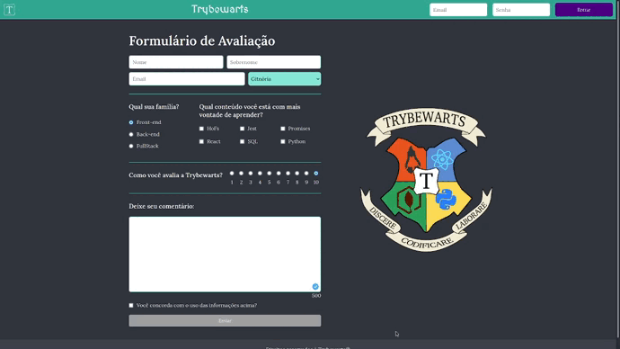
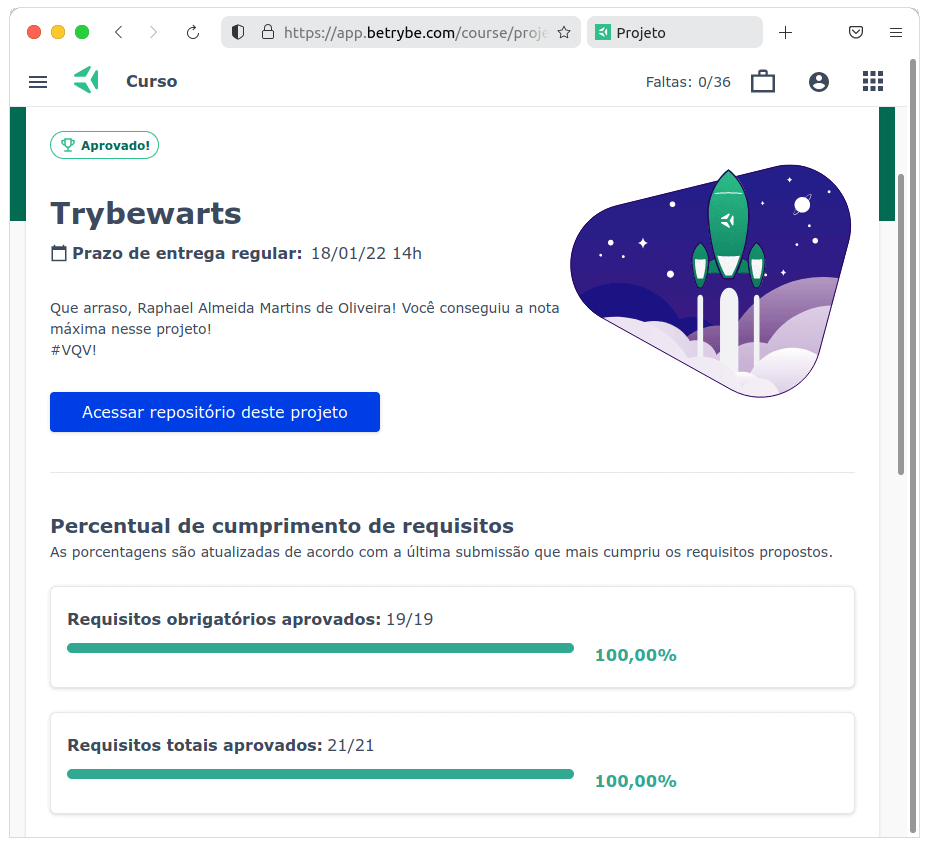

# :sparkles: Trybewarts :sparkles:

## :page_with_curl: About/Sobre

  
<strong>:us: English</strong>
 

Project of HTML, CSS, and JavaScript developed by me ([Raphael Martins](https://www.linkedin.com/in/raphaelameidamartins/)) and [Bruna Cardoso](https://www.linkedin.com/in/bruna-cardoso-38536916b/) at the end of Unit 6 ([Principles of Web Development Module](https://github.com/raphaelalmeidamartins/trybe_exercicios/tree/main/1_fundamentos-do-desv-web)) of [Trybe](https://www.betrybe.com)'s Web Development course. I was approved with 100% of the mandatory and optional requirements met.

We developed a responsive web page with forms.

[Click here](https://raphaelalmeidamartins.github.io/trybewarts/) to check out the final version of the project on your browser.
 

  
<strong>:brazil: Português</strong>
 

Projeto de HTML, CSS e JavaScript desenvolvido por mim ([Raphael Martins](https://www.linkedin.com/in/raphaelameidamartins/)) e [Bruna Cardoso](https://www.linkedin.com/in/bruna-cardoso-38536916b/) ao final do Bloco 6 ([Módulo Fundamentos do Desenvolvimento Web](https://github.com/raphaelalmeidamartins/trybe_exercicios/tree/main/1_fundamentos-do-desv-web)) do curso da Trybe. Fomos aprovado com 100% dos requisitos obrigatórios e opcionais atingidos.

Tivemos que desenvolver uma página responsiva com um formulário HTML.

[Clique aqui](https://raphaelalmeidamartins.github.io/trybewarts/) para conferir a versão final do projeto no seu navegador.
 

## :man_technologist: Developed Skills/Habilidades Desenvolvidas

  
<strong>:us: English</strong>
 

* Develop a form with HTML and CSS
* Work in pairs
* Use CSS to implement a responsive layout
 

  
<strong>:brazil: Português</strong>
 

* Desenvolver um formulário com HTML e CSS
* Trabalhar em dupla
* Usar CSS para implementar um layout responsivo
 

## :hammer_and_wrench: Tools/Ferramentas

* HTML5
* CSS3
* JavaScript ES6+

## :memo: Methodologies/Metodologias

* Mobile First
* Pair programming

## :trophy: Grade/Nota

### :copyright: Copyright disclaimer/Aviso de direitos autorais

  
<strong>:us: English</strong>
 

We developed this project for learning purposes, all the code and documentation texts in Portuguese and English are our authorship, and the rights belong exclusively to us. It is allowed to download or clone the repository for study purposes. However, it is not allowed to publish full or partial copies. This disclaimer does not cover libraries and dependencies, which are subject to their respective licenses. It does not cover the Trybewarts logo, either.
 

  
<strong>:brazil: Português</strong>
 

Desenvolvemos esse projeto para propósitos de aprendizagem, todo o código e documentação são de nossa autoria e os direitos pertencem exclusivamente a nós. É permitido baixar ou clonar o repositório para fins de estudo. Contudo, não é permitido publicar cópias totais ou parciais. Este aviso não cobre bibliotecas e dependências, estas estão sujeitas a suas respectivas licenças.
 

